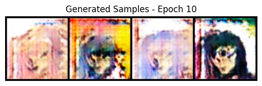
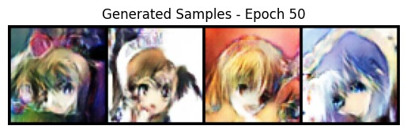
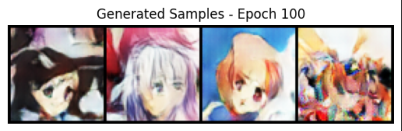
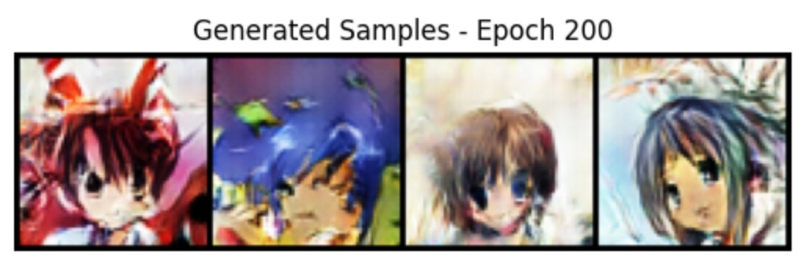

# Manga Comic Character Generator - DCGAN

## Contributors
- [Aditya Nair](https://github.com/adityanair98)
- [Bhumika Srinivas](https://github.com/bhumikasrc)
- [Rashmi Panse](https://github.com/rxshmi-p)

## Overview
The Manga Character Generator is a project that leverages Generative Adversarial Networks (GANs) to generate manga characters. The project aims to generate manga characters that are unique and diverse which can be used in comic books, animations, and other creative projects.

Medium Article: [Manga Character Generator](https://)

## Dataset

The dataset used for training the model is the [Anime Face Dataset](https://www.kaggle.com/datasets/aadilmalik94/animecharacterfaces) from Kaggle. The dataset contains 9754 pictures of anime faces, and the overall size of the data is 797 MB of anime faces from the 2000’s.

## Model Architecture

The model architecture used for the project is a Deep Convolutional Generative Adversarial Network (DCGAN). The DCGAN is a type of GAN that uses convolutional neural networks for both the generator and the discriminator. The generator network takes random noise as input and generates images, while the discriminator network takes images as input and classifies them as real or fake.

## Results

We trained the model for 200 epochs with a batch size of 128. Due to the limited computational resources, we trained the model on Google Colab. Further training the model for more epochs and on a larger dataset can improve the quality of the generated images.

Here are some of the generated manga characters:

